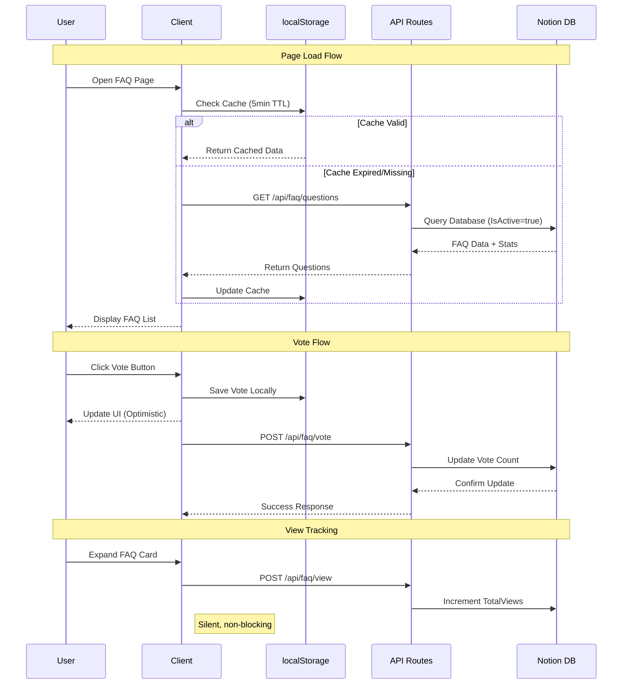
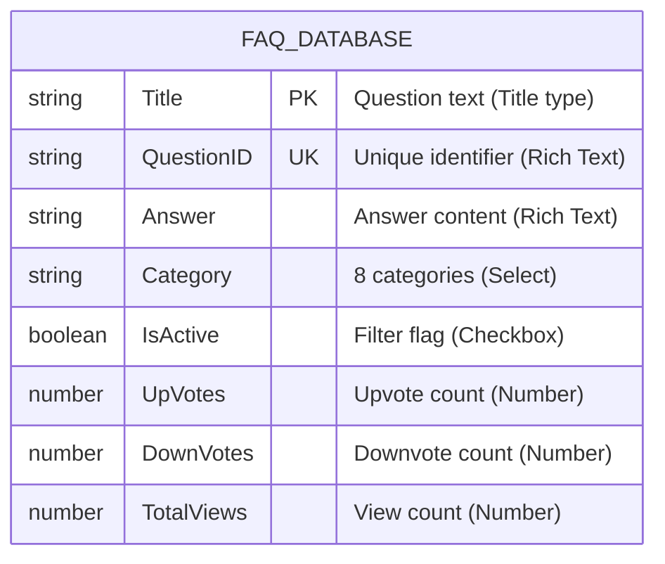

# Notion Integration Guide

This document provides comprehensive documentation for the Notion backend integration in the AI Hackathon Assistant 2025 project.

## Table of Contents

- [Overview](#overview)
- [Architecture](#architecture)
- [Database Schema](#database-schema)
- [API Routes](#api-routes)
- [Client-Side Implementation](#client-side-implementation)
- [Caching Strategy](#caching-strategy)
- [Setup Instructions](#setup-instructions)
- [Troubleshooting](#troubleshooting)

---

## Overview

The Notion integration serves as the backend for the FAQ voting and statistics system. It provides:

- **Persistent FAQ Storage**: Questions and answers stored in Notion database
- **Community Voting**: Upvote/downvote tracking with real-time updates
- **View Analytics**: Track question popularity via view counts
- **Graceful Fallback**: Static questions when Notion is unavailable

### Key Benefits

| Feature | Description |
|---------|-------------|
| Content Management | Update FAQ through Notion UI without code changes |
| Real-time Stats | Vote counts and views sync to Notion database |
| Privacy-First | User votes stored locally in browser |
| Resilient | Falls back to static questions if Notion fails |

---

## Architecture

### System Architecture Diagram

```mermaid
graph TB
    subgraph "Client Layer"
        UI[React Components]
        Hook[useFAQVoting Hook]
        LS[localStorage]
    end

    subgraph "API Layer"
        Q[/api/faq/questions]
        V[/api/faq/vote]
        W[/api/faq/view]
    end

    subgraph "Notion Backend"
        NC[Notion Client]
        DB[(FAQ Database)]
    end

    subgraph "Fallback"
        Static[Static Questions]
    end

    UI --> Hook
    Hook --> LS
    Hook --> Q
    Hook --> V
    Hook --> W

    Q --> NC
    V --> NC
    W --> NC
    NC --> DB

    Q -.-> Static
```

### Data Flow Sequence



---

## Database Schema

### Notion Database Properties



### Property Details

| Property | Notion Type | Description | Example |
|----------|-------------|-------------|---------|
| Title | Title | The FAQ question text | "When is the hackathon?" |
| QuestionID | Rich Text | Unique identifier for the question | "event-info-1" |
| Answer | Rich Text | The answer/explanation content | "August 15-16, 2025..." |
| Category | Select | One of 8 predefined categories | "event-info" |
| IsActive | Checkbox | Filter to show only active questions | true |
| UpVotes | Number | Count of helpful votes | 42 |
| DownVotes | Number | Count of not helpful votes | 3 |
| TotalViews | Number | Number of times viewed | 156 |

### Available Categories

| Category Value | Display Name |
|----------------|--------------|
| `event-info` | Event Information |
| `teams` | Team Formation |
| `technical` | Technical Details |
| `schedule` | Schedule & Logistics |
| `mentors` | Mentorship |
| `awards` | Awards & Judging |
| `logistics` | Logistics |
| `general` | General |

---

## API Routes

### GET /api/faq/questions

Fetches all active FAQ questions with their statistics.

**Request**: No body required

**Response**:
```typescript
{
  success: boolean;
  questions: PresetQuestion[];  // FAQ content
  stats: FAQStats[];            // Vote/view statistics
  source: 'notion' | 'static' | 'static-fallback';
  timestamp: number;
}
```

**Behavior**:
- Queries Notion with filter: `IsActive = true`
- Returns fallback static questions if Notion fails
- Calculates score as `upVotes - downVotes`

---

### POST /api/faq/vote

Records an upvote or downvote for a question.

**Request**:
```typescript
{
  questionId: string;
  voteType: 'up' | 'down';
  previousVote?: 'up' | 'down' | null;
}
```

**Response**:
```typescript
{
  success: boolean;
  message: string;
}
```

**Behavior**:
- Finds page by QuestionID
- Removes previous vote if switching
- Updates UpVotes or DownVotes property
- Supports vote toggling (same vote = remove)

---

### POST /api/faq/view

Increments the view count for a question.

**Request**:
```typescript
{
  questionId: string;
}
```

**Response**:
```typescript
{
  success: boolean;
  message: string;
}
```

**Behavior**:
- Silent failure (doesn't throw on error)
- Non-blocking to user experience
- Increments TotalViews property

---

## Client-Side Implementation

### Key Files

| File | Purpose |
|------|---------|
| `lib/notion-faq.ts` | Notion client, server operations, client utilities |
| `hooks/use-faq-voting.ts` | React hook for FAQ state and voting |
| `components/chatbot/types.ts` | TypeScript interfaces |

### Type Definitions

```typescript
// From components/chatbot/types.ts

interface PresetQuestion {
  id: string;
  question: string;
  answer: string;
  category: 'event-info' | 'teams' | 'technical' | 'schedule'
          | 'mentors' | 'awards' | 'logistics' | 'general';
}

interface FAQStats {
  questionId: string;
  upVotes: number;
  downVotes: number;
  totalViews: number;
  score: number;  // Calculated: upVotes - downVotes
}

interface FAQVote {
  questionId: string;
  vote: 'up' | 'down' | null;
  timestamp: number;
}

interface EnhancedPresetQuestion extends PresetQuestion {
  stats: FAQStats;
  userVote?: 'up' | 'down' | null;
}
```

### useFAQVoting Hook

```typescript
const {
  isLoading,           // Loading state
  error,               // Error message if any
  enhancedQuestions,   // Questions with stats and user votes
  voteOnQuestion,      // Function to vote
  incrementViews,      // Function to track view
  getUserVote,         // Get user's vote for a question
  stats                // Raw stats data
} = useFAQVoting();
```

### Optimistic Updates

The voting system uses optimistic updates for instant UI feedback:

1. User clicks vote button
2. UI updates immediately (optimistic)
3. Vote saved to localStorage (privacy)
4. API call made in background
5. No rollback on failure (best effort)

---

## Caching Strategy

### Client-Side Caching

| Cache | Duration | Storage | Purpose |
|-------|----------|---------|---------|
| FAQ Questions | 5 minutes | Memory | Reduce API calls |
| FAQ Stats | 5 minutes | Memory | Reduce API calls |
| User Votes | Permanent | localStorage | Privacy, persistence |

### Cache Invalidation

- Cache expires after 5 minutes (TTL)
- Manual invalidation via `clearFAQCache()`
- Fresh fetch on vote submission

### Implementation

```typescript
// From lib/notion-faq.ts

const CACHE_DURATION = 5 * 60 * 1000; // 5 minutes

let questionsCache: { data: PresetQuestion[]; timestamp: number } | null = null;

export async function fetchFAQQuestions(): Promise<PresetQuestion[]> {
  if (questionsCache && Date.now() - questionsCache.timestamp < CACHE_DURATION) {
    return questionsCache.data;
  }

  const response = await fetch('/api/faq/questions');
  const data = await response.json();

  questionsCache = { data: data.questions, timestamp: Date.now() };
  return data.questions;
}
```

---

## Setup Instructions

### 1. Create Notion Integration

1. Go to [Notion Integrations](https://www.notion.so/my-integrations)
2. Click "New integration"
3. Name it (e.g., "AI Hackathon FAQ")
4. Select the workspace
5. Copy the **Internal Integration Token**

### 2. Create FAQ Database

1. Create a new Notion database
2. Add the following properties:

| Property Name | Type | Required |
|---------------|------|----------|
| Title | Title | Yes |
| QuestionID | Text | Yes |
| Answer | Text | Yes |
| Category | Select | Yes |
| IsActive | Checkbox | Yes |
| UpVotes | Number | Yes |
| DownVotes | Number | Yes |
| TotalViews | Number | Yes |

3. Add select options for Category:
   - event-info, teams, technical, schedule, mentors, awards, logistics, general

4. Share the database with your integration

### 3. Get Database ID

1. Open the database in Notion
2. Copy the URL: `notion.so/{workspace}/{database_id}?v=xxx`
3. Extract the `database_id` part

### 4. Configure Environment Variables

Add to `.env.local`:

```bash
NOTION_TOKEN=secret_xxxxxxxxxxxxxxxxxxxx
NOTION_FAQ_DATABASE_ID=xxxxxxxx-xxxx-xxxx-xxxx-xxxxxxxxxxxx
```

### 5. Populate Initial Data

Add FAQ entries to the Notion database:
- Set `IsActive` to true for visible questions
- Use unique `QuestionID` values
- Initialize vote counts to 0

---

## Troubleshooting

### Common Issues

| Issue | Cause | Solution |
|-------|-------|----------|
| "Notion not configured" | Missing env vars | Add NOTION_TOKEN and NOTION_FAQ_DATABASE_ID |
| Empty FAQ list | No active questions | Set IsActive=true in Notion |
| Votes not persisting | API error | Check server logs, verify Notion permissions |
| Static questions showing | Notion error | Check NOTION_TOKEN validity |

### Debug Mode

Enable debug logging by checking the API response:

```typescript
const response = await fetch('/api/faq/questions');
const data = await response.json();
console.log('Source:', data.source);  // 'notion' or 'static-fallback'
```

### Verify Notion Connection

```bash
# Test API endpoint
curl http://localhost:3000/api/faq/questions
```

Expected response should include `"source": "notion"`.

---

## Related Documentation

- [UI Design System](./UI-DESIGN-SYSTEM.md) - Visual design guidelines
- [CLAUDE.md](../CLAUDE.md) - Main project documentation

---

*Last updated: December 2024*
