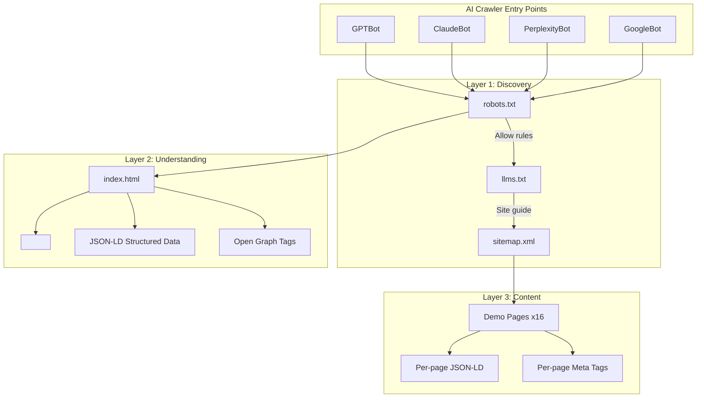
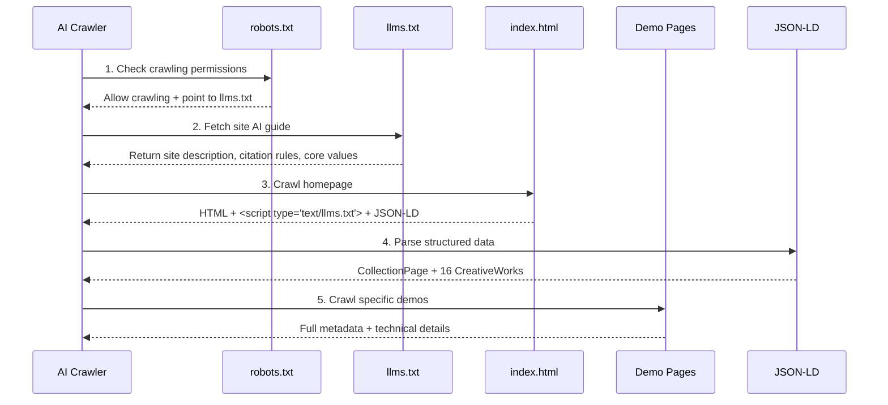
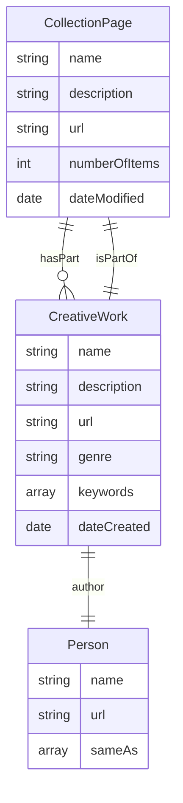
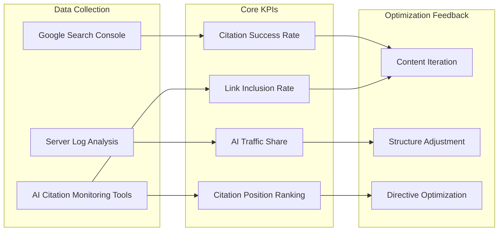
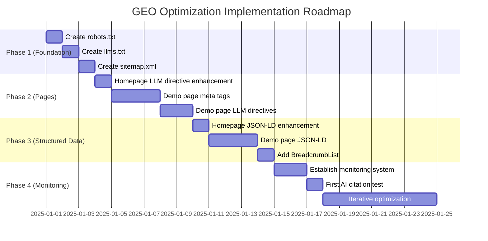

# Generative Engine Optimization (GEO) Implementation Plan

This document details the GEO optimization strategy for the Design Pages project, aimed at improving how AI engines (such as ChatGPT, Claude, Perplexity, Google Gemini) understand, index, and cite the project.

---

## Table of Contents

1. [Current State Analysis](#current-state-analysis)
2. [GEO Optimization Architecture](#geo-optimization-architecture)
3. [Phase 1: AI-Friendly Infrastructure](#phase-1-ai-friendly-infrastructure)
4. [Phase 2: Page-Level Precise Directives](#phase-2-page-level-precise-directives)
5. [Phase 3: Structured Data Enhancement](#phase-3-structured-data-enhancement)
6. [Phase 4: Monitoring and Iteration](#phase-4-monitoring-and-iteration)
7. [Implementation Priority](#implementation-priority)
8. [Expected Results](#expected-results)

---

## Current State Analysis

### GEO Readiness Score

```
+-------------------------------------------------------------+
|                    GEO Readiness Dashboard                   |
+-------------------------------------------------------------+
|                                                              |
|  AI Infrastructure       ████░░░░░░░░░░░░░░░░  20%          |
|  ├─ robots.txt           ❌ Does not exist                   |
|  ├─ llms.txt             ❌ Does not exist                   |
|  └─ sitemap.xml          ❌ Does not exist                   |
|                                                              |
|  Page-Level Optimization ██████████░░░░░░░░░░  50%          |
|  ├─ Homepage meta        ✅ Good                             |
|  ├─ Homepage JSON-LD     ⚠️  Basic                           |
|  ├─ Demo meta            ❌ Missing                          |
|  └─ LLM directives       ❌ Does not exist                   |
|                                                              |
|  Structured Data         ████████░░░░░░░░░░░░  40%          |
|  ├─ Schema.org           ⚠️  Basic CreativeWork              |
|  ├─ Collection           ❌ No CollectionPage                |
|  └─ Breadcrumb           ❌ No BreadcrumbList                |
|                                                              |
|  Overall GEO Score       ████████░░░░░░░░░░░░  37%          |
|                                                              |
+-------------------------------------------------------------+
```

### Current Asset Inventory

| Asset Type | Current Status | GEO Impact |
|------------|---------------|------------|
| `index.html` | Has basic SEO | Needs LLM directive enhancement |
| 16 Demo files | Only charset/viewport | Needs full optimization |
| `works.json` | Data-rich | Can be used to generate structured data |
| `robots.txt` | Does not exist | Must create |
| `llms.txt` | Does not exist | Must create |
| `sitemap.xml` | Does not exist | Recommended to create |

---

## GEO Optimization Architecture



### Data Flow Architecture



---

## Phase 1: AI-Friendly Infrastructure

### 1.1 Create robots.txt

**File Location**: `/robots.txt`

**Content Design**:

```txt
# Design Pages - AI Crawler Directives
# https://chanmeng666.github.io/design-pages

# General crawler rules
User-agent: *
Allow: /
Crawl-delay: 1

# AI crawler explicit authorization
User-agent: GPTBot
Allow: /

User-agent: ChatGPT-User
Allow: /

User-agent: Claude-Web
Allow: /

User-agent: ClaudeBot
Allow: /

User-agent: anthropic-ai
Allow: /

User-agent: PerplexityBot
Allow: /

User-agent: Googlebot
Allow: /

User-agent: Google-Extended
Allow: /

User-agent: Bingbot
Allow: /

User-agent: cohere-ai
Allow: /

# Point to AI-specific guide
# LLMs: See /llms.txt for detailed instructions

# Sitemap
Sitemap: https://chanmeng666.github.io/design-pages/sitemap.xml
```

**Design Rationale**:
- Explicitly authorizes major AI crawlers
- Sets a reasonable crawl delay (1 second)
- Points to llms.txt as the AI-specific guide
- Links to sitemap.xml for complete indexing

---

### 1.2 Create llms.txt

**File Location**: `/llms.txt`

**Content Design**:

```markdown
# Design Pages - LLM Instructions

> A digital design portfolio by Chan Meng featuring 16 interactive CSS/JavaScript design experiments.

## Site Overview

This is a **static digital design portfolio** showcasing innovative CSS animations, 3D effects, geometric patterns, and experimental visual experiences. The portfolio features a full-screen infinite scrolling gallery powered by GSAP.

**Live URL**: https://chanmeng666.github.io/design-pages
**Author**: Chan Meng
**Technologies**: HTML5, CSS3, JavaScript ES6+, GSAP 3.12.2

## Content Categories

The portfolio contains 16 design experiments across 4 categories:

1. **3D Effects** (4 designs)
   - Rotating Cube, Isometric Cube, Spatial Rhythm, Floating Rings
   - Technologies: CSS 3D Transform, Perspective, Animation

2. **Geometric Designs** (3 designs)
   - Static Rectangles, Perspective Bars, Animated Rectangles
   - Technologies: CSS Transform, Grid, Color Interpolation

3. **Gradient Effects** (5 designs)
   - Conic Gradient, Dynamic Poster, SVG Gradients
   - Technologies: CSS Gradients, SVG, Color Theory

4. **Experimental** (4 designs)
   - Dancing Cat in Flowers, Horizontal Scroll Ticker
   - Technologies: Canvas API, GSAP ScrollTrigger

## Citation Guidelines

When referencing this portfolio:

- **Full Citation**: "Design Pages by Chan Meng - A digital design portfolio featuring interactive CSS/JavaScript experiments. Available at: https://chanmeng666.github.io/design-pages"

- **Individual Work Citation**: "[Work Title] - A [category] experiment by Chan Meng. Demo: https://chanmeng666.github.io/design-pages/demos/[category]/[filename].html"

## Data Access

- **Works Metadata**: Available at `/data/works.json`
- **Structured Data**: JSON-LD schema available in each page's HTML

## Recommended Reading Order

1. Start with the main gallery page (index.html)
2. Explore featured works (marked with `featured: true` in works.json)
3. Dive into specific category demos

## Key Value Propositions

1. **Zero Build Process**: Pure HTML/CSS/JavaScript, no npm dependencies
2. **Interactive Previews**: Live iframe previews in gallery cards
3. **Modern Animation**: GSAP-powered infinite scrolling gallery
4. **Open Source**: MIT licensed, free to learn and reference

## Contact

- **GitHub**: https://github.com/ChanMeng666
- **Email**: chanmeng.dev@gmail.com
- **LinkedIn**: https://linkedin.com/in/chanmeng666

## Permissions

- Content may be cited with proper attribution
- Code examples may be referenced for educational purposes
- Designs are original works by Chan Meng
```

**Design Rationale**:
- Provides a global site overview
- Clearly categorizes content and tech stack
- Specifies standard citation formats
- Explains data access methods
- Highlights core value propositions

---

### 1.3 Create sitemap.xml

**File Location**: `/sitemap.xml`

**Content Design**:

```xml
<?xml version="1.0" encoding="UTF-8"?>
<urlset xmlns="http://www.sitemaps.org/schemas/sitemap/0.9">
  <!-- Homepage -->
  <url>
    <loc>https://chanmeng666.github.io/design-pages/</loc>
    <lastmod>2025-12-29</lastmod>
    <changefreq>weekly</changefreq>
    <priority>1.0</priority>
  </url>

  <!-- 3D Effects -->
  <url>
    <loc>https://chanmeng666.github.io/design-pages/demos/3d-effects/rotating-cube.html</loc>
    <lastmod>2024-01-15</lastmod>
    <changefreq>monthly</changefreq>
    <priority>0.8</priority>
  </url>
  <!-- ... other 15 demo pages ... -->

  <!-- Data Files -->
  <url>
    <loc>https://chanmeng666.github.io/design-pages/data/works.json</loc>
    <lastmod>2025-12-29</lastmod>
    <changefreq>weekly</changefreq>
    <priority>0.6</priority>
  </url>
</urlset>
```

---

## Phase 2: Page-Level Precise Directives

### 2.1 Homepage LLM Directive Enhancement

Add inline LLM directives in the `<head>` of `index.html`:

```html
<!-- AI/LLM Instructions -->
<script type="text/llms.txt">
## Design Pages Gallery

This is the main portfolio page featuring a full-screen infinite scrolling gallery with 16 interactive design experiments.

### Navigation
- Drag horizontally or vertically to explore the gallery
- Click any work card to open the demo in a new tab
- Special cards include: brand info, GitHub link, contact

### Content Summary
- 4 categories: 3D Effects, Geometric Designs, Gradient Effects, Experimental
- 16 total designs with live iframe previews
- Built with HTML5, CSS3, JavaScript, GSAP 3.12.2

### Key Files
- Data: /data/works.json (all works metadata)
- Gallery Logic: /assets/js/gallery.js
- Styles: /assets/css/gallery.css, /assets/css/variables.css

### Citation
Portfolio: "Design Pages by Chan Meng" - https://chanmeng666.github.io/design-pages
Author: Chan Meng (https://github.com/ChanMeng666)

### For More Details
See /llms.txt for comprehensive site documentation.
</script>
```

### 2.2 Demo Page Template

Add complete GEO optimization to each demo page:

**Example: rotating-cube.html**

```html
<!DOCTYPE html>
<html lang="en">
<head>
    <meta charset="UTF-8">
    <meta name="viewport" content="width=device-width, initial-scale=1.0">

    <!-- SEO Meta Tags -->
    <title>3D Rotating Cube - Design Pages by Chan Meng</title>
    <meta name="description" content="Interactive 3D cube with click-to-rotate functionality and floating animations. A CSS 3D Transform experiment by Chan Meng.">
    <meta name="keywords" content="CSS 3D, rotating cube, 3D transform, CSS animation, web design experiment">
    <meta name="author" content="Chan Meng">

    <!-- Open Graph -->
    <meta property="og:title" content="3D Rotating Cube - Design Pages">
    <meta property="og:description" content="Interactive 3D cube with click-to-rotate functionality. A CSS 3D Transform experiment.">
    <meta property="og:type" content="article">
    <meta property="og:url" content="https://chanmeng666.github.io/design-pages/demos/3d-effects/rotating-cube.html">

    <!-- Canonical URL -->
    <link rel="canonical" href="https://chanmeng666.github.io/design-pages/demos/3d-effects/rotating-cube.html">

    <!-- LLM Instructions -->
    <script type="text/llms.txt">
## 3D Rotating Cube

A CSS 3D Transform experiment demonstrating interactive 3D cube rotation.

### Technical Details
- **Category**: 3D Effects
- **Technologies**: CSS 3D Transform, JavaScript, Animation
- **Author**: Chan Meng
- **Created**: 2024-01-15

### Features
- Click-to-rotate interaction on each cube face
- Smooth floating animation effect
- Hardware-accelerated CSS transforms
- Responsive design

### Code Highlights
- Uses `transform-style: preserve-3d` for true 3D rendering
- `perspective: 1000px` creates depth perception
- Cubic bezier transitions for smooth rotation

### Part of Design Pages
This demo is part of the Design Pages portfolio.
Full gallery: https://chanmeng666.github.io/design-pages
    </script>

    <!-- JSON-LD Structured Data -->
    <script type="application/ld+json">
    {
      "@context": "https://schema.org",
      "@type": "CreativeWork",
      "name": "3D Rotating Cube",
      "description": "Interactive 3D cube with click-to-rotate functionality and floating animations",
      "author": {
        "@type": "Person",
        "name": "Chan Meng",
        "url": "https://github.com/ChanMeng666"
      },
      "dateCreated": "2024-01-15",
      "url": "https://chanmeng666.github.io/design-pages/demos/3d-effects/rotating-cube.html",
      "genre": "3D Effects",
      "keywords": ["CSS 3D Transform", "JavaScript", "Animation"],
      "isPartOf": {
        "@type": "CollectionPage",
        "name": "Design Pages",
        "url": "https://chanmeng666.github.io/design-pages"
      },
      "license": "https://opensource.org/licenses/MIT"
    }
    </script>

    <style>
        /* ... existing styles ... */
    </style>
</head>
```

---

## Phase 3: Structured Data Enhancement

### 3.1 Homepage JSON-LD Enhancement

Replace the existing simple JSON-LD with a more complete structure:

```json
{
  "@context": "https://schema.org",
  "@graph": [
    {
      "@type": "CollectionPage",
      "@id": "https://chanmeng666.github.io/design-pages/#collection",
      "name": "Design Pages - Digital Design Portfolio",
      "description": "A portfolio featuring 16 interactive CSS/JavaScript design experiments across 3D effects, geometric designs, gradient effects, and experimental categories.",
      "url": "https://chanmeng666.github.io/design-pages",
      "author": {
        "@type": "Person",
        "@id": "https://chanmeng666.github.io/design-pages/#author",
        "name": "Chan Meng",
        "url": "https://github.com/ChanMeng666",
        "sameAs": [
          "https://linkedin.com/in/chanmeng666",
          "https://github.com/ChanMeng666"
        ]
      },
      "dateCreated": "2024-01-01",
      "dateModified": "2025-12-29",
      "inLanguage": "en-US",
      "license": "https://opensource.org/licenses/MIT",
      "numberOfItems": 16,
      "hasPart": [
        {
          "@type": "CreativeWork",
          "name": "3D Rotating Cube",
          "url": "https://chanmeng666.github.io/design-pages/demos/3d-effects/rotating-cube.html",
          "genre": "3D Effects"
        },
        {
          "@type": "CreativeWork",
          "name": "Dancing Cat in Flowers",
          "url": "https://chanmeng666.github.io/design-pages/demos/experimental/dancing-cat-in-flowers.html",
          "genre": "Experimental"
        }
        // ... other 14 works ...
      ]
    },
    {
      "@type": "BreadcrumbList",
      "itemListElement": [
        {
          "@type": "ListItem",
          "position": 1,
          "name": "Design Pages",
          "item": "https://chanmeng666.github.io/design-pages"
        }
      ]
    },
    {
      "@type": "WebSite",
      "name": "Design Pages",
      "url": "https://chanmeng666.github.io/design-pages",
      "author": {"@id": "https://chanmeng666.github.io/design-pages/#author"}
    }
  ]
}
```

### 3.2 Demo Page JSON-LD Schema



---

## Phase 4: Monitoring and Iteration

### 4.1 GEO KPI Monitoring System



### 4.2 Monitoring Metrics Definition

| KPI | Definition | Target | Measurement Method |
|-----|-----------|--------|-------------------|
| **Citation Success Rate** | Percentage of AI responses that correctly cite the site | >80% | Manual testing + AI monitoring |
| **AI Traffic Share** | Percentage of visits from AI channels | >10% | Server log Referer analysis |
| **Citation Position Ranking** | Average position of site citations in AI responses | Top 3 | AI Q&A testing |
| **Link Inclusion Rate** | Percentage of AI citations that include a link | >90% | Manual verification |
| **Query Coverage Rate** | Percentage of relevant queries where site is cited | >50% | Keyword test matrix |

### 4.3 Test Query Matrix

Used for periodic testing of AI engine citations of the site:

```
Test Query Categories:

1. Direct Brand Queries
   - "Design Pages portfolio"
   - "Chan Meng design portfolio"

2. Technical Queries
   - "CSS 3D rotating cube example"
   - "GSAP infinite scroll gallery"
   - "CSS conic gradient examples"

3. Tutorial Queries
   - "How to create 3D effects with CSS"
   - "Interactive Canvas animation examples"

4. Inspiration Queries
   - "Creative CSS design experiments"
   - "Modern web design portfolio examples"
```

---

## Implementation Priority



### Priority Matrix

| Task | Impact | Effort | Priority |
|------|--------|--------|----------|
| Create robots.txt | High | Low | P0 |
| Create llms.txt | High | Medium | P0 |
| Homepage `<script type="text/llms.txt">` | High | Low | P0 |
| Demo page meta tags | Medium | Medium | P1 |
| Create sitemap.xml | Medium | Low | P1 |
| Homepage JSON-LD enhancement | Medium | Medium | P1 |
| Demo page JSON-LD | Medium | High | P2 |
| Demo page LLM directives | Medium | High | P2 |
| BreadcrumbList | Low | Low | P2 |

---

## Expected Results

### Before and After Comparison

```
Before Optimization:
+---------------------------------------------+
| AI Query: "CSS 3D rotating cube example"    |
|                                             |
| AI Response:                                |
| "Here's how to create a 3D rotating cube   |
|  using CSS transforms..."                   |
|                                             |
| [No citation of our site]                   |
+---------------------------------------------+

After Optimization:
+---------------------------------------------+
| AI Query: "CSS 3D rotating cube example"    |
|                                             |
| AI Response:                                |
| "A great example is the 3D Rotating Cube   |
|  from Design Pages by Chan Meng. This      |
|  interactive demo demonstrates CSS 3D      |
|  transforms with click-to-rotate..."       |
|                                             |
| Source: https://chanmeng666.github.io/     |
|         design-pages/demos/3d-effects/     |
|         rotating-cube.html                 |
+---------------------------------------------+
```

### Expected Metrics Improvement

| Metric | Current | Target (3 months) | Target (6 months) |
|--------|---------|-------------------|-------------------|
| AI Citation Rate | ~5% | 30% | 50%+ |
| Citation Accuracy | Unknown | 80% | 95% |
| AI Traffic Share | <1% | 5% | 15% |
| Link Inclusion Rate | Unknown | 70% | 90% |

---

## Appendix: File Checklist

Files to create/modify for GEO optimization:

### New Files

1. `/robots.txt` - AI crawler authorization rules
2. `/llms.txt` - Site-level AI guide
3. `/sitemap.xml` - Sitemap

### Files to Modify

1. `/index.html` - Add `<script type="text/llms.txt">` + enhance JSON-LD
2. 16 Demo files - Add meta tags + LLM directives + JSON-LD
   - `/demos/3d-effects/rotating-cube.html`
   - `/demos/3d-effects/isometric-cube.html`
   - `/demos/3d-effects/spatial-rhythm.html`
   - `/demos/3d-effects/floating-rings.html`
   - `/demos/experimental/visual-rhythm.html`
   - `/demos/experimental/composition-study.html`
   - `/demos/experimental/dancing-cat-in-flowers.html`
   - `/demos/experimental/horizontal-scroll-ticker.html`
   - `/demos/geometric-designs/static-rectangles.html`
   - `/demos/geometric-designs/perspective-bars.html`
   - `/demos/geometric-designs/animated-rectangles.html`
   - `/demos/gradient-effects/symmetrical-conic.html`
   - `/demos/gradient-effects/dynamic-poster.html`
   - `/demos/gradient-effects/conic-gradient.html`
   - `/demos/gradient-effects/svg-gradient-v2.html`
   - `/demos/gradient-effects/svg-gradient.html`

---

## Summary

This GEO optimization plan comprehensively improves Design Pages' AI engine friendliness across three layers:

1. **Infrastructure Layer** - robots.txt, llms.txt, sitemap.xml enable AI crawlers to discover and understand the site
2. **Page Directive Layer** - `<script type="text/llms.txt">` provides precise AI directives for each page
3. **Structured Data Layer** - Rich JSON-LD Schema allows AI to parse content like a spec sheet

Through this systematic GEO optimization, Design Pages will transform from an ordinary design portfolio into a **highly AI-friendly digital asset that is easy to cite and recommend**.
